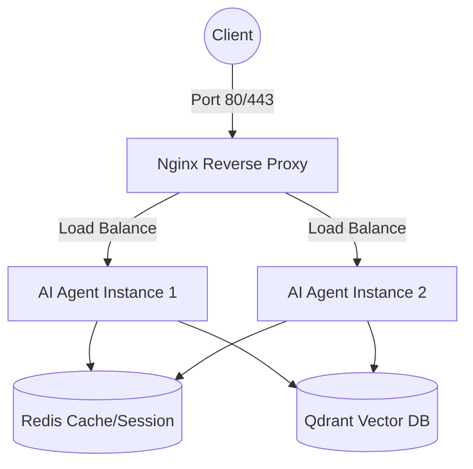

# Mission Answers - Day 12

## Part 1: Localhost vs Production

### Exercise 1.1: Phát hiện anti-patterns
1. **Hardcoded Secrets**: API keys và Database URLs được viết trực tiếp vào mã nguồn.
2. **Thiếu Configuration Management**: Các biến như `DEBUG` được fix cứng thay vì dùng environment variables.
3. **Sử dụng print() thay vì Logging**: Không có cấu trúc log, in cả thông tin nhạy cảm.
4. **Thiếu Health Check**: Không có endpoint để hệ thống giám sát biết tình trạng ứng dụng.
5. **Cấu hình Port/Host cố định**: Chạy cứng ở `localhost:8000` thay vì đọc từ môi trường, gây khó khăn khi deploy container/cloud.

### Exercise 1.3: So sánh Basic vs Advanced

| Feature | Basic (develop) | Advanced (production) | Tại sao quan trọng? |
|---------|-------|----------|---------------------|
| Config | Hardcode trong file | Environment variables (Pydantic Settings) | Bảo mật thông tin nhạy cảm và linh hoạt cấu hình theo môi trường. |
| Health check | Không có | `/health` (Liveness) & `/ready` (Readiness) | Giúp hệ thống điều phối (Docker, Cloud) tự động giám sát và quản lý traffic. |
| Logging | `print()` thủ công | Structured JSON logging | Dễ dàng quản lý, truy vết và phân tích log tập trung ở quy mô lớn. |
| Shutdown | Đột ngột | Graceful (SIGTERM handler & lifespan) | Tránh mất dữ liệu và đảm bảo hoàn thành các request đang xử lý trước khi tắt. |

## Part 2: Docker Containerization

### Exercise 2.1: Dockerfile cơ bản

1.  **Base image là gì?**: `python:3.11` (bản phân phối Python đầy đủ, kích thước lớn nhưng ổn định).
2.  **Working directory là gì?**: `/app` (thư mục gốc chứa mã nguồn bên trong container).
3.  **Tại sao COPY requirements.txt trước?**: Để tận dụng **Docker Layer Cache**. Do các thư viện ít khi thay đổi hơn mã nguồn, việc copy và cài đặt requirements trước giúp Docker không phải cài lại thư viện mỗi khi sửa code, giúp quá trình build nhanh hơn nhiều.
4.  **CMD vs ENTRYPOINT khác nhau thế nào?**:
    *   `ENTRYPOINT`: Là lệnh "bất di bất dịch" (thường là), xác định ứng dụng chính mà container chạy.
    *   `CMD`: Cung cấp tham số mặc định cho ENTRYPOINT hoặc là lệnh chạy mặc định. Điểm khác biệt lớn nhất là `CMD` có thể bị ghi đè dễ dàng khi chạy lệnh `docker run`, trong khi `ENTRYPOINT` khó bị ghi đè hơn và thường được dùng để biến container thành một file thực thi.

### Exercise 2.2: Build và run
Image size quan sát được là khoảng 1.66 GB. Lý do là sử dụng base image python:3.11 (full distribution), chứa nhiều công cụ không cần thiết cho môi trường chạy.

### Exercise 2.3: Multi-stage build (02-docker/production/Dockerfile)

-   **Stage 1 (Builder) làm gì?**: Sử dụng base image `python:3.11-slim`, cài đặt các công cụ cần thiết để build (`gcc`, `libpq-dev`), sau đó tải và cài đặt toàn bộ dependencies vào thư mục `/root/.local`. Stage này đóng vai trò như nhà bếp để chuẩn bị nguyên liệu.
-   **Stage 2 (Runtime) làm gì?**: Chỉ copy những thứ cần thiết để chạy ứng dụng từ Stage 1 (thư mục `.local`) và mã nguồn vào một image sạch (`python:3.11-slim`). Stage này cũng thiết lập bảo mật bằng cách chạy dưới một user không có quyền root (`appuser`).
-   **Tại sao image nhỏ hơn?**: 
    1.  **Sử dụng Base Image "slim"**: Nhỏ hơn nhiều so với bản full.
    2.  **Loại bỏ rác build**: Các công cụ build (`gcc`, `pip cache`) chỉ ở Stage 1 và không được đưa vào Stage cuối cùng.
    3.  **Tối ưu hóa Layer**: Chỉ giữ lại những file thực sự cần thiết để khởi chạy app.

**So sánh thực tế:**
-   `my-agent:develop` (Single-stage): **1.66 GB**
-   `my-agent:advanced` (Multi-stage): **236 MB**
*(Kích thước đã giảm hơn 85%)*

### Exercise 2.4: Docker Compose stack

**1. Sơ đồ kiến trúc (Architecture Diagram):**

**2. Các Services được khởi tạo:**
-   **agent**: Chứa logic của AI Agent (FastAPI).
-   **redis**: Dùng để lưu trữ session và quản lý rate limiting.
-   **qdrant**: Vector Database dùng cho các tác vụ RAG (Retrieval-Augmented Generation).
-   **nginx**: Đóng vai trò là cổng vào (Reverse Proxy) và điều phối tải (Load Balancer).

**3. Cơ chế giao tiếp (Communication):**
-   Tất cả các service nằm trong một mạng nội bộ (`internal`) kiểu `bridge`.
-   Người dùng chỉ có thể tiếp cận hệ thống thông qua Nginx (Port 80/443).
-   Nginx chuyển tiếp request đến các instance của `agent` thông qua tên service trong mạng nội bộ.
-   `agent` kết nối với `redis` và `qdrant` cũng qua tên service và port nội bộ của chúng (6379 và 6333).

## Part 3: Cloud Deployment

### Exercise 3.2: So sánh render.yaml với railway.toml

-   **railway.toml**: Tập trung vào cấu hình runtime và deployment cho một service duy nhất (builder, startCommand, healthcheckPath). Cấu trúc đơn giản, dễ tiếp cận.
-   **render.yaml (Blueprint)**: Mạnh mẽ hơn nhờ khả năng định nghĩa **toàn bộ hạ tầng** (Infrastructure as Code). Một file có thể chứa nhiều service (Web, Database, Redis), quy định vùng địa lý (Region), gói dịch vụ (Plan) và các cơ chế quản lý biến môi trường nâng cao (sync/generate).

### Exercise 3.3: Hiểu CI/CD pipeline (Google Cloud Run)

-   **cloudbuild.yaml (Pipeline Steps)**: Định nghĩa "cách thức" triển khai theo từng bước:
    1.  **Test**: Chạy Unit Test tự động, nếu lỗi thì dừng Pipeline ngay lập tức.
    2.  **Build**: Tạo Docker Image từ mã nguồn.
    3.  **Push**: Đẩy Image lên Registry trung tâm (GCR).
    4.  **Deploy**: Cập nhật Image mới lên dịch vụ Cloud Run.
-   **service.yaml (Infrastructure Definition)**: Định nghĩa "trạng thái" của hạ tầng trên Cloud Run:
    -   **Autoscaling**: Cấu hình `minScale` (giảm cold start) và `maxScale` (kiểm soát chi phí).
    -   **Resources**: Giới hạn CPU và RAM rõ ràng.
    -   **Health Checks**: Sử dụng `livenessProbe` và `startupProbe` để hệ thống tự phục hồi nếu app gặp lỗi.
    
## Part 4: API Security

### Exercise 4.1: API Key authentication

1.  **API key được check ở đâu?**: Được kiểm tra trong hàm `verify_api_key` (Dependency Injection). FastAPI sẽ kiểm tra header `X-API-Key` trước khi cho phép request đi vào logic xử lý của endpoint `/ask`.
2.  **Điều gì xảy ra nếu sai key?**:
    -   **401 Unauthorized**: Nếu người dùng không gửi kèm header `X-API-Key`.
    -   **403 Forbidden**: Nếu gửi key nhưng không khớp với giá trị `AGENT_API_KEY` được cấu hình trên server.
3.  **Làm sao rotate key?**: Thay đổi giá trị của biến môi trường `AGENT_API_KEY` trên hệ thống quản lý (như Dashboard của Railway/Render) và khởi động lại dịch vụ. Toàn bộ các request sau đó sẽ yêu cầu Key mới.

### Exercise 4.3: Rate limiting 

1.  **Algorithm nào được dùng?**: Thuật toán **Sliding Window Counter** (Cửa sổ trượt). Nó chính xác hơn Fixed Window vì không bị bùng nổ request ở thời điểm chuyển giao giữa 2 phút.
2.  **Limit là bao nhiêu requests/minute?**:
    -   **User mới/vô danh**: 10 requests/phút.
    -   **Admin**: 100 requests/phút.
3.  **Làm sao bypass limit cho admin?**: Sử dụng cơ chế phân tầng (Tiered limiting). Admin không bị áp dụng chung bộ đếm với user thường mà có một instance `rate_limiter_admin` riêng biệt với hạn mức cao hơn rất nhiều.

